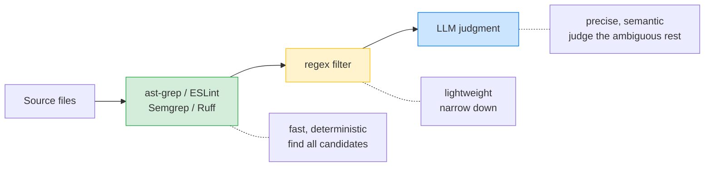

# deep-lint

Composable multi-stage lint pipelines — chain ast-grep, regex, ESLint, Semgrep, Ruff, and LLM review in declarative YAML rules.

## Why deep-lint?

Linting tools face a fundamental tradeoff between precision and coverage:

**Built-in linter rules** are all-or-nothing. ESLint's `no-eval` bans every `eval()` call — even `eval("2+2")` in a build script. Ruff's S301 flags every `pickle.load()` — even from a trusted local cache. Teams disable these rules entirely, losing protection against the real bugs they were meant to catch.

**Custom programmatic rules** (ESLint plugins, custom AST visitors) can encode more complex logic, but they are fundamentally limited to what syntax structure and text patterns can determine. They cannot reason about developer intent, trust boundaries, or semantic context. Checks like "is this eval input user-controlled?" or "is this self-comparison an intentional NaN check?" are impossible to express as AST visitors.

**Pure LLM code review** can reason about anything, but it is expensive (processes entire files), slow, non-deterministic, and produces unfocused feedback. Asking an LLM to review every line of code is impractical at scale.

deep-lint combines these approaches in multi-stage pipelines. Structural tools find candidates. The LLM judges only the ambiguous remainder — answering a specific yes/no question about a specific code snippet, not providing open-ended review.

## How it works



Each stage does what it is best at. The pipeline narrows candidates progressively, so expensive LLM analysis runs only on the few cases that cheaper stages could not resolve.

## Example: smart eval() detection

Consider this file with five `eval()` calls — some dangerous, some safe:

```typescript
 1 | // DANGEROUS: eval of user-controlled input
 2 | function executeUserCode(userInput: string) {
 3 |   return eval(userInput);
 4 | }
 5 |
 6 | // DANGEROUS: eval of data from network request
 7 | async function processRemoteScript(url: string) {
 8 |   const script = await (await fetch(url)).text();
 9 |   return eval(script);
10 | }
11 |
12 | // SAFE: eval of sanitized, internally-generated code
13 | function createAccessor(fieldName: string) {
14 |   const sanitized = fieldName.replace(/[^a-zA-Z0-9_]/g, "");
15 |   const code = `(function(obj) { return obj.${sanitized}; })`;
16 |   return eval(code);
17 | }
18 |
19 | // SAFE: eval guarded by NODE_ENV check
20 | function devConsole(expression: string) {
21 |   if (process.env.NODE_ENV !== "production") {
22 |     return eval(expression);
23 |   }
24 | }
25 |
26 | // SAFE: eval of hardcoded math expression
27 | function calculateTax(amount: number) {
28 |   const formula = "amount * 0.15";
29 |   return eval(formula);
30 | }
```

**Traditional approach** — ESLint's `no-eval` flags every call:

```
eval-usage.ts:3    error  eval can be harmful  no-eval
eval-usage.ts:9    error  eval can be harmful  no-eval
eval-usage.ts:16   error  eval can be harmful  no-eval
eval-usage.ts:22   error  eval can be harmful  no-eval
eval-usage.ts:29   error  eval can be harmful  no-eval

✖ 5 problems (5 errors)
```

Five findings, all identical messages. A custom ESLint rule could try to filter some — but it cannot determine whether `userInput` comes from a user or whether `code` was safely constructed. That requires semantic understanding of the data flow and trust boundary, which is beyond what AST analysis can express. The team disables `no-eval`. Now the dangerous calls go undetected.

**deep-lint approach** — ESLint finds them, LLM judges each one:

```yaml
id: no-unsafe-eval
language: typescript
severity: error
description: "Flag eval() with untrusted input, allow eval of trusted/static content"
pipeline:
  - eslint:
      rules:
        no-eval: error
  - llm:
      prompt: |
        ESLint flagged this eval() call. Is the input user-controlled
        (dangerous) or trusted/static (safe)?
        Code: $MATCHED_CODE
      confidence_threshold: 0.8
```

```
eval-usage.ts:3    error  eval() with user-controlled input        no-unsafe-eval
eval-usage.ts:9    error  eval() with data from network request    no-unsafe-eval

✖ 2 problems (2 errors)
```

The ESLint stage finds all five `eval()` calls (fast, deterministic). The LLM stage evaluates each one and filters out the three safe cases — sanitized input, dev-only guard, hardcoded constant. Only the genuinely dangerous calls remain. This two-stage pipeline is [integration tested](tests/integration/unsafe-eval.test.ts) against realistic code.

## Quick Start

```bash
npm install deep-lint
```

```bash
# Structural stages only (no LLM, no API key needed)
npx deep-lint scan --rules ./rules --no-llm ./src

# Full pipeline including LLM stages
npx deep-lint scan --rules ./rules ./src

# JSON output for CI integration
npx deep-lint scan --rules ./rules --format json ./src

# Filter by severity
npx deep-lint scan --rules ./rules --severity error ./src

# Enable caching for LLM results
npx deep-lint scan --rules ./rules --cache ./src
```

To use LLM stages, configure a provider via the [Vercel AI SDK](https://sdk.vercel.ai/):

```typescript
import { buildPipeline } from "deep-lint";
import { anthropic } from "@ai-sdk/anthropic";

const pipeline = buildPipeline(rule, {
  model: anthropic("claude-sonnet-4-20250514"),
});
```

Any Vercel AI SDK compatible provider works: OpenAI, Anthropic, Google, Ollama, etc.

## Writing Rules

Rules are YAML files with a pipeline of stages. Three examples, escalating in complexity:

### Single stage — ast-grep pattern matching

```yaml
id: no-console-log
language: typescript
severity: warning
description: "Avoid console.log in production code"
pipeline:
  - ast-grep:
      pattern: "console.log($$$ARGS)"
```

### Two stages — regex composition (no LLM needed)

ESLint's `no-warning-comments` bans all TODOs. This rule only flags TODOs missing an issue reference:

```yaml
id: no-todo-without-issue
language: typescript
severity: warning
description: "TODO/FIXME/HACK comments must reference a tracking issue"
pipeline:
  - regex:
      pattern: "(?<tag>TODO|FIXME|HACK)[:(]?\\s*(?<message>.*)"
  - regex:
      pattern: "(#\\d+|[A-Z]+-\\d+|https?://)"
      invert: true    # Filter OUT matches that have issue refs — keep only untracked TODOs
```

Stage 1 finds all TODO/FIXME/HACK comments. Stage 2 (inverted) filters out those that already reference an issue (`#1234`, `JIRA-567`, or a URL). Only untracked TODOs remain as violations.

### Three stages — structural matching + text filtering + LLM judgment

```yaml
id: no-unhandled-promise
language: typescript
severity: error
description: "Promise-returning calls must be awaited, caught, or explicitly voided"
pipeline:
  - ast-grep:
      pattern: "$FUNC($$$ARGS)"
  - regex:
      pattern: "(await |return |void |\\.then|\\.catch)"
      invert: true
  - llm:
      prompt: |
        This function call may return a Promise that is not awaited or caught.
        Code: $MATCHED_CODE
        Function: $FUNC
        Is the missing await intentional (fire-and-forget for analytics/logging)?
      confidence_threshold: 0.8
```

Stage 1 (ast-grep) finds all function calls. Stage 2 (regex, inverted) filters out calls that are already awaited, returned, voided, or chained with `.then`/`.catch`. Stage 3 (LLM) evaluates the remaining candidates — distinguishing intentional fire-and-forget from actual bugs. Each stage narrows the set, so the LLM only processes the few truly ambiguous cases.

## Stages

| Stage | Description | Use case |
|-------|-------------|----------|
| `ast-grep` | Structural AST matching via `@ast-grep/napi` | Find code by structure: function calls, assignments, patterns |
| `regex` | Text pattern matching with capture groups and `invert` mode | Find text patterns, filter by content, extract named groups |
| `eslint` | ESLint rule integration for JS/TS | Leverage ESLint's existing rule ecosystem |
| `semgrep` | Semgrep pattern matching (multi-language) | Cross-language SAST patterns, taint tracking |
| `ruff` | Ruff integration for Python | Fast Python security and style analysis |
| `llm` | LLM-based semantic analysis via Vercel AI SDK | Judge intent, evaluate context, reduce false positives |

## LLM Prompt Variables

LLM prompts support interpolation of candidate data:

| Variable | Description |
|----------|-------------|
| `$MATCHED_CODE` | The code snippet matched by previous stages |
| `$FILE_PATH` | Path to the source file |
| `$FILE_CONTENT` | Full file content |
| `$SURROUNDING(N)` | N lines of context around the match |
| `$START_LINE`, `$END_LINE` | Line numbers of the match |
| `$LANGUAGE` | Target language of the rule |
| `$VAR` | Any metavariable captured by ast-grep, regex, or semgrep (e.g., `$FUNC`, `$ARGS`) |

## Built-in Rules

deep-lint ships with tested rules in the `rules/` directory:

| Rule | Pipeline | Language | Description |
|------|----------|----------|-------------|
| `no-console-log` | ast-grep | TypeScript | Avoid console.log in production code |
| `no-any-cast` | ast-grep | TypeScript | Avoid `as any` type casts |
| `no-todo-without-issue` | regex → regex | TypeScript | TODOs must reference a tracking issue |
| `no-hardcoded-env-config` | regex → llm | TypeScript | No hardcoded dev/staging URLs in production code |
| `no-unsafe-eval` | eslint → llm | TypeScript | Flag eval() with untrusted input |
| `no-unhandled-promise` | ast-grep → regex → llm | TypeScript | Promises must be awaited or caught |
| `ensure-error-handling` | ast-grep → llm | TypeScript | Async functions should have error handling |
| `no-tautological-comparison` | semgrep → llm | TypeScript | Flag self-comparisons (likely copy-paste bugs) |
| `no-unsafe-pickle` | ruff → llm | Python | Flag pickle deserialization of untrusted data |

## Programmatic API

```typescript
import {
  parseRuleYaml,
  buildPipeline,
  executePipeline,
} from "deep-lint";

const rule = parseRuleYaml(`
id: no-console-log
language: typescript
severity: warning
description: "No console.log"
pipeline:
  - ast-grep:
      pattern: "console.log($$$ARGS)"
`);

const pipeline = buildPipeline(rule, { skipLlm: true });
const result = await executePipeline(pipeline, [
  {
    filePath: "app.ts",
    content: 'console.log("hello");',
    language: "typescript",
  },
]);

const findings = result.candidates.filter((c) => !c.filtered);
console.log(`Found ${findings.length} violations`);
```

## How Pipelines Work

1. The first stage (typically ast-grep, regex, or a tool integration) **produces** candidates from source files
2. Subsequent stages **filter** and **annotate** candidates
3. Candidates marked `filtered: true` are excluded from results but preserved in execution traces
4. The pipeline **short-circuits** when all candidates are filtered — remaining stages are skipped
5. Each stage narrows the candidate set, so expensive stages (LLM) run last on fewer candidates

## Caching

LLM calls are the most expensive part of a pipeline — both in latency and cost. deep-lint includes a filesystem-based cache that stores LLM verdicts per candidate, so repeated scans skip LLM calls for code that hasn't changed.

```bash
# Enable caching (results stored in .deep-lint/cache by default)
npx deep-lint scan --rules ./rules --cache ./src

# Custom cache directory
npx deep-lint scan --rules ./rules --cache --cache-dir .cache ./src

# Clear cache
npx deep-lint scan --clear-cache
```

How it works:
- Each LLM verdict is cached with a key derived from the model, prompt template, confidence threshold, and the interpolated code snippet
- Cache entries are sharded on disk (like git objects) with atomic writes for concurrent safety
- TTL-based expiration (7 days by default) ensures stale results are refreshed
- Pipeline traces report `cacheHits` and `cacheMisses` per stage, so you can see the savings

On a second scan of unchanged code, LLM stages complete instantly from cache — reducing a multi-second pipeline to milliseconds.

```typescript
import { FsCacheStore } from "deep-lint";

const cacheStore = new FsCacheStore({
  cacheDir: ".deep-lint/cache",
  ttlMs: 7 * 24 * 60 * 60 * 1000, // 7 days
});

const result = await executePipeline(pipeline, files, { cacheStore });
// result.trace.stages[1].cacheHits → number of cached LLM verdicts reused
```

## Supported Languages

TypeScript, JavaScript, TSX, JSX, Python, Go, Rust, Java, C, C++, HTML, CSS

## Development

```bash
npm install
npm test          # Run tests
npm run build     # Build with tsup
npm run lint      # Type-check
```

## License

MIT
